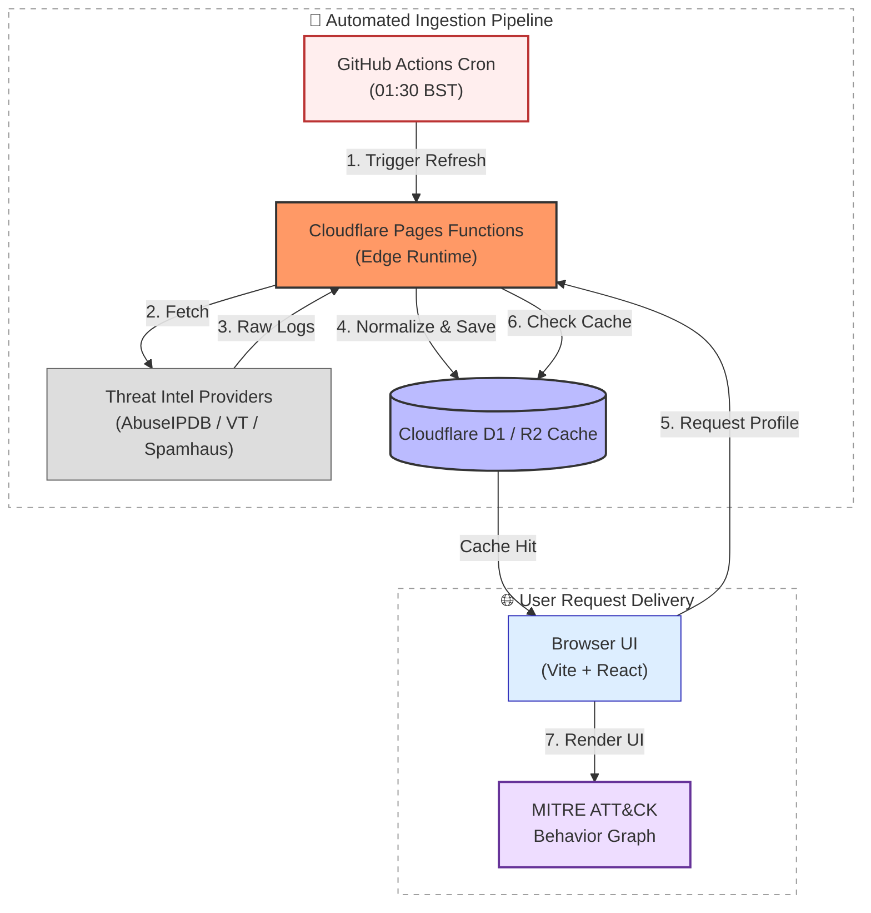

# Dominic Boban: Cybersecurity Engineering Portfolio

A production-grade cybersecurity portfolio, threat intelligence suite, and serverless content platform.

This application is deployed natively at the edge on **Cloudflare Pages** and engineered using **React, Vite, TypeScript, and Cloudflare Pages Functions**.

[](https://github.com/dom4570/dominic-boban-portfolio/actions/workflows/semgrep.yml)

[](https://github.com/dom4570/dominic-boban-portfolio/actions/workflows/github-code-scanning/codeql)

---

# 🌐 System Architecture & Data Flow

This platform splits operational workloads into two distinct, decoupled pipelines to enforce strict API quota defense while maintaining sub-second, edge-cached response windows for clients.



# 🛠️ Core Features & Capabilities

## 1. Personal Portfolio & Brand Engine

The central landing hub serves as a fast-loading verification vehicle for technical recruitment and industry collaborators.

### Components
- Custom hero section
- Interactive skills inventory
- Chronologically structured experience timeline
- Production projects index
- Certified credentials catalog

### Integrations
- Direct CV download routing
- Authenticated GitHub/LinkedIn outbound links
- Active contact form for recruiters and clients

---

## 2. Global Threat Dashboard

**Route:** `/global-threat-dashboard`

Processes and visualizes global Layer 7 network telemetry to display macro internet security trends.

### Telemetry Data
- Live Cloudflare Radar telemetry datasets

### Visuals
- Attack geography distributions
- Top origin threat vectors
- Targeted country groups
- Dynamic origin-to-target Sankey visualizations

---

## 3. Daily Top 50 Threat Map

**Route:** `/live-threat-map`

An interactive OSINT geographic map rendering top global threat actors without deploying misleading simulated honeypots.

### Telemetry Data
- AbuseIPDB global blacklist feeds

### Visuals
- Geo-IP source pins via Leaflet
- Ranked leaderboard (#1–#50)

### Source Intelligence Panel
Displays:
- Raw IP addresses
- City/country metadata
- ASN ownership
- Network ranges
- Reporting timestamps

---

## 4. IP Intelligence Enrichment Pipeline

Deep reputation inspection integrated directly into the threat map interface.

### Telemetry Data
- Spamhaus DQS DNS queries

### Reputation Zones
- SBL
- XBL
- PBL
- AuthBL

### Output
- Raw return codes
- Listing data names
- Block justifications

---

## 5. Identity Exposure Scanner

**Route:** `/identity-exposure-scanner`

A compliant breach exposure query interface built for demonstration testing.

### Logic
- Accepts user-supplied emails
- Performs server-side breach intelligence lookups

### Output
- Aggregate risk levels
- Breach occurrences
- Paste exposure metrics
- Compromise timelines
- Leaked data classifications
- Remediation guidance

---

## 6. Dynamic Blog & Field Notes Platform

**Route:** `/blog`

A technical ledger for:
- Vulnerability writeups
- Detection engineering notes
- Research updates

### Logic
Dynamic edge-resolved markdown routing under:

```txt
/blog/{slug}
```

---

## 7. Gated Administration Dashboard

**Route:** `/admin`

A zero-trust administration panel for live blog and media management.

### Infrastructure
- Cloudflare D1
- Cloudflare R2

### Security
Protected using Cloudflare Access Zero Trust authorization.

---

# 🔒 Defensive Engineering & Security Architecture

The ecosystem is designed around defensive coding patterns to isolate secrets and protect upstream infrastructure.

## Backend/API Security Design

### Zero Client Exposure
All secrets remain server-side:
- AbuseIPDB
- Spamhaus DQS
- VirusTotal
- Cloudflare Radar

### Edge Compute Abstraction
All network processing is handled through Cloudflare Pages Functions.

### Deterministic Threat Persona Engine
Telemetry normalization avoids hallucinated LLM inference and instead maps raw telemetry into verified MITRE ATT&CK techniques such as:
- T1110 — Brute Force
- T1595 — Active Scanning
- T1190 — Exploit Public-Facing Application

### API Quota Preservation & Caching
- 24-hour edge caching
- GitHub Actions cron warm-up jobs
- Rate-limit protection
- Cache-boundary enforcement

### Allowlist Guard
IP lookups are restricted to recent threat-map entities to prevent abuse.

### Graceful Degradation
Fallback states are returned if upstream intelligence providers fail.

---

# ⚙️ Runtime Configuration & Secret Injection

## Environment Variables

| Variable | Provider | Purpose |
|---|---|---|
| CLOUDFLARE_RADAR_TOKEN | Cloudflare Radar | API access |
| ABUSEIPDB_API_KEY | AbuseIPDB | Blacklist extraction |
| SPAMHAUS_DQS_KEY | Spamhaus | DNS reputation lookups |
| SPAMHAUS_SIA_USERNAME | Spamhaus | Optional historical lookup |
| SPAMHAUS_SIA_PASSWORD | Spamhaus | Optional historical lookup |
| SPAMHAUS_SIA_TOKEN | Spamhaus | Optional bearer fallback |
| VIRUSTOTAL_API_KEY | VirusTotal | Reputation enrichment |
| THREAT_MAP_CRON_SECRET | GitHub Actions | Protected refresh secret |

---

# 🧪 Local Infrastructure Testing

```bash
export ABUSEIPDB_API_KEY="your_key_here"
export CLOUDFLARE_RADAR_TOKEN="your_token_here"
export SPAMHAUS_DQS_KEY="your_key_here"
export SPAMHAUS_SIA_USERNAME="your_optional_sia_username"
export SPAMHAUS_SIA_PASSWORD="your_optional_sia_password"
export VIRUSTOTAL_API_KEY="your_key_here"
export THREAT_MAP_CRON_SECRET="your_shared_cron_secret"

npm run dev
```

The Daily Top 50 threat map is scheduled through:

```txt
.github/workflows/daily-threat-map-refresh.yml
```

---

# 🚀 Production Deployment

Production variables must be mapped inside:

```txt
Cloudflare Pages → Project Settings → Environment Variables
```

---

# 🛡️ Security Challenge & Verification

This repository uses:
- Semgrep OSS
- GitHub CodeQL

These pipelines help identify:
- XSS
- Path traversal
- Broken authentication
- Injection vulnerabilities

## Scope Challenge

Admin routes are protected via:
- Zero Trust JWT verification
- Markdown sanitization pipelines
- `rehypeSanitize`

If you discover a vulnerability, refer to:

```txt
SECURITY.md
```

for responsible disclosure instructions.

---

# 🚀 Tech Stack

## Frontend
- React
- Vite
- TypeScript
- Tailwind CSS
- Leaflet

## Infrastructure
- Cloudflare Pages
- Cloudflare Pages Functions
- Cloudflare D1
- Cloudflare R2

## Threat Intelligence Sources
- AbuseIPDB
- Spamhaus DQS
- Cloudflare Radar
- VirusTotal

## Security Tooling
- Semgrep
- GitHub CodeQL

---

# 📌 Project Status

This project is actively maintained as a cybersecurity engineering portfolio and threat intelligence demonstration platform.
