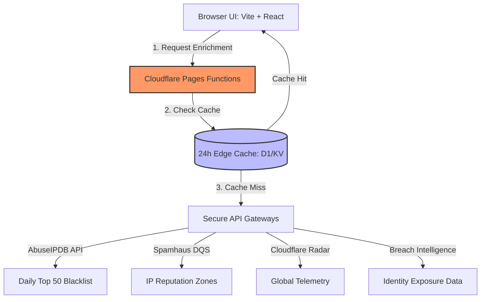

# Dominic Boban: Cybersecurity Engineering Portfolio

A production-grade cybersecurity portfolio, threat intelligence suite, and serverless content platform. This application is deployed natively at the edge on **Cloudflare Pages** and engineered using **React, Vite, TypeScript, and Cloudflare Pages Functions**.

[](https://github.com/dom4570/dominic-boban-portfolio/actions/workflows/semgrep.yml)
[](https://github.com/dom4570/dominic-boban-portfolio/actions/workflows/github-code-scanning/codeql)

---

## 🌐 System Architecture & Data Flow



---

## 🛠️ Core Features & Capabilities

### 1. Personal Portfolio & Brand Engine

The central landing hub serves as a fast-loading verification vehicle for technical recruitment and industry collaborators.

**Components:** Custom hero section, interactive skills inventory, chronologically structured experience timeline, production projects index, and certified credentials catalog.

**Integrations:** Direct CV download routing, authenticated GitHub/LinkedIn secure outbound links, and an active contact form for clients/recruiters.

### 2. Global Threat Dashboard

**Route:** `/global-threat-dashboard`

Processes and visualizes global Layer 7 network telemetry to display macro internet security trends.

**Telemetry Data:** Ingests live Cloudflare Radar telemetry datasets.

**Visuals:** Renders attack geography distributions, top origin threat vectors, targeted country groups, and dynamic origin-to-target Sankey/flow matrix visualizations.

### 3. Daily Top 50 Threat Map

**Route:** `/live-threat-map`

An interactive OSINT geographic map rendering top global threat actors without deploying aggressive or misleading simulated honeypots on the portfolio itself.

**Telemetry Data:** Pulls malicious source nodes from AbuseIPDB's global blacklist feed.

**Visuals:** Renders geo-IP source pins via Leaflet map layouts alongside an active ranked leaderboard from #1 to #50.

**Source Intelligence Panel:** Displays selected node attributes including raw IP address, target city/country metadata, ASN ownership, network range allocations, and timestamped reporting cycles.

### 4. IP Intelligence Enrichment Pipeline

Deep reputation inspection nested cleanly into the active threat map interface.

**Telemetry Data:** Performs server-side DNS queries against Spamhaus DQS components.

**Reputation Zones Evaluated:** SBL, XBL, PBL, and AuthBL.

**Output:** Extracts raw return codes, corresponding listing data names, and block justifications.

### 5. Identity Exposure Scanner

**Route:** `/identity-exposure-scanner`

A compliant breach exposure query interface built for demonstration testing.

**Logic:** Accepts user-supplied emails and passes them down to server-side breach intelligence providers.

**Output:** Generates aggregate risk levels, breach occurrences, paste exposure metrics, linear compromise timelines, leaked data classifications, and remediation playbooks.

### 6. Dynamic Blog & Field Notes Platform

**Route:** `/blog`

An active technical ledger mapping research updates, vulnerability writeups, and detection engineering notes.

**Logic:** Resolves paths dynamically at the edge to serve dedicated markdown content components under `/blog/{slug}`.

### 7. Gated Administration Dashboard

**Route:** `/admin`

A zero-trust administration panel built to create, update, or remove live technical blog posts and handle media object storage.

**Infrastructure:** Uses Cloudflare D1 as the serverless relational data store and Cloudflare R2 for media object buckets.

**Security:** Gated behind Cloudflare Access Zero Trust authorization, removing code rebuild requirements for content publication cycles.

---

## 🔒 Defensive Engineering & Security Architecture

The ecosystem is built around defensive coding patterns to protect upstream resources and isolate secrets.

### Backend/API Security Design

**Zero Client Exposure:** Upstream authentication secrets, tokens, and verification keys for AbuseIPDB, Spamhaus DQS, and Cloudflare Radar remain server-side. The frontend runtime never exposes these credentials.

**Edge Compute Abstraction:** Network input processing, query transformations, and routing are handled through serverless Cloudflare Pages Functions.

**API Quota Preservation & Caching:** Implements 24-hour edge caching layers on resource-intensive threat intelligence endpoints. Client reloads pull records from edge cache where possible, helping protect API rate limits.

**Graceful Degradation:** Integration paths include fallback error handling. If an upstream intelligence API times out or fails, the application returns labelled fallback states instead of breaking the user experience.

---

## ⚙️ Runtime Configuration & Secret Injection

To run this platform locally or deploy to production, verify the following configuration schema is mapped correctly.

| Environment Variable | Provider Target | Assigned Context Scope |
|---|---|---|
| `CLOUDFLARE_RADAR_TOKEN` | Cloudflare Radar API | Account → Radar → Read Permissions |
| `ABUSEIPDB_API_KEY` | AbuseIPDB Engine | Inbound blacklist extraction key |
| `SPAMHAUS_DQS_KEY` | Spamhaus Edge DQS | 26-character bare customer code token |
| `SPAMHAUS_SIA_USERNAME` | Spamhaus Intelligence API | Optional API username for historical IP listing context |
| `SPAMHAUS_SIA_PASSWORD` | Spamhaus Intelligence API | Optional API password for historical IP listing context |
| `SPAMHAUS_SIA_TOKEN` | Spamhaus Intelligence API | Optional short-lived bearer token fallback for historical IP listing context |

### Local Infrastructure Testing

Pass environment variables through your terminal before launching the local preview boundary.

```bash
export ABUSEIPDB_API_KEY="your_key_here"
export CLOUDFLARE_RADAR_TOKEN="your_token_here"
export SPAMHAUS_DQS_KEY="your_key_here"
export SPAMHAUS_SIA_USERNAME="your_optional_sia_username"
export SPAMHAUS_SIA_PASSWORD="your_optional_sia_password"
npm run dev
```

### Production Deployment

Production variables must be mapped in the Cloudflare Pages Management Console:

```text
Project Settings → Environment Variables
```

---

## 🛡️ Security Challenge & Verification

This codebase uses automated testing pipelines. Merge and deployment workflows can trigger Semgrep OSS and GitHub CodeQL scans to detect issues such as cross-site scripting, path traversal, and broken authentication paths before code reaches production.

### Scope Challenge

Think you found an input validation bypass or an edge cache manipulation flaw? The admin routes are enforced via Zero Trust JWT verification, and incoming markdown payloads are expected to pass through sanitization pipelines such as `rehypeSanitize`.

If you discover an exploitable state, please open an issue with a clear proof-of-concept vector and reproduction steps.

---

## 🚀 Tech Stack

- **Frontend:** React, Vite, TypeScript
- **Hosting:** Cloudflare Pages
- **Serverless Runtime:** Cloudflare Pages Functions
- **Database:** Cloudflare D1
- **Object Storage:** Cloudflare R2
- **Threat Intelligence Sources:** AbuseIPDB, Spamhaus DQS, Cloudflare Radar
- **Security Tooling:** Semgrep, GitHub CodeQL

---

## 📌 Project Status

This project is actively maintained as a cybersecurity engineering portfolio and threat intelligence demonstration platform.
